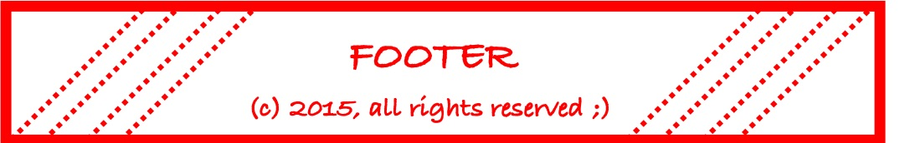
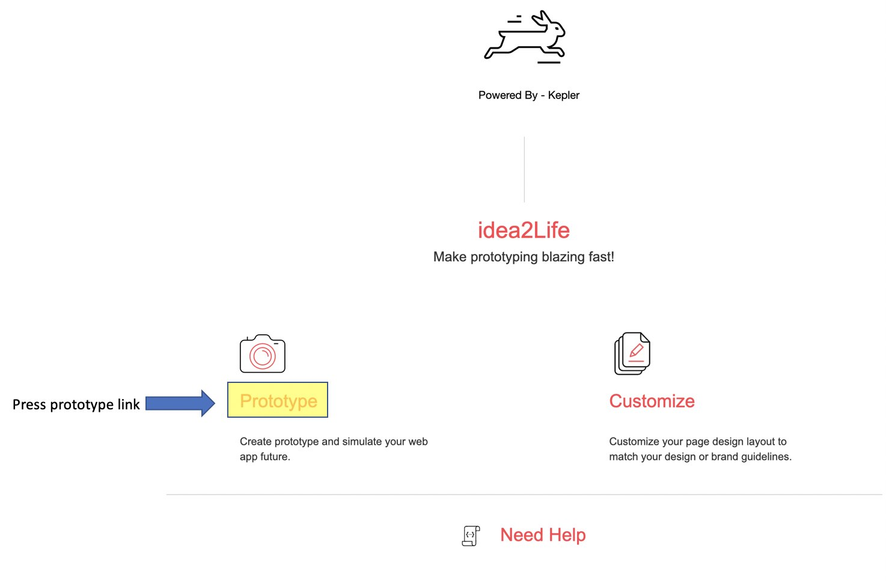
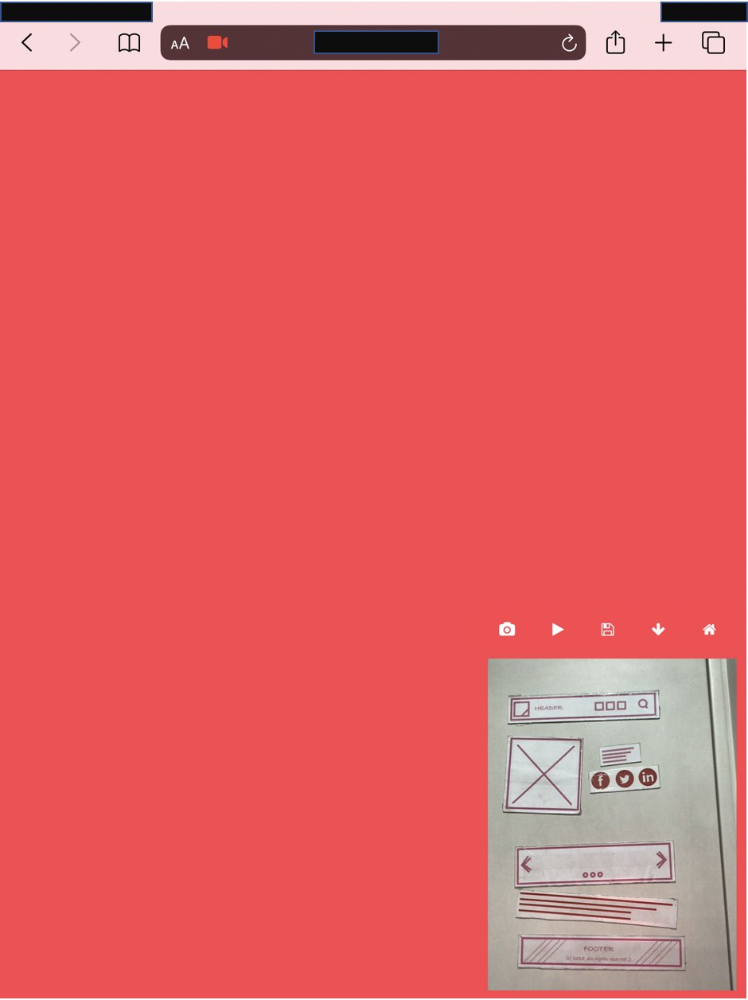
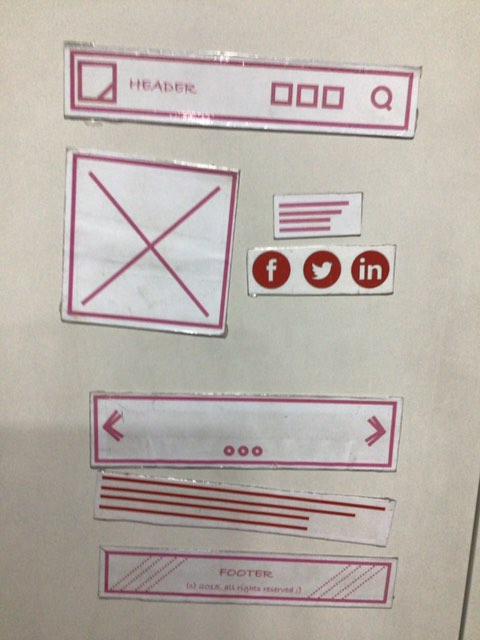
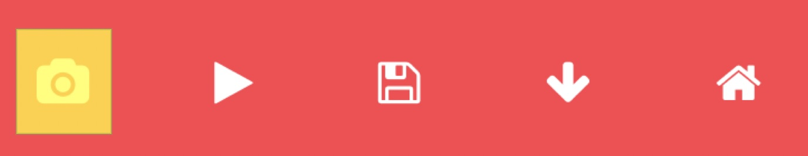
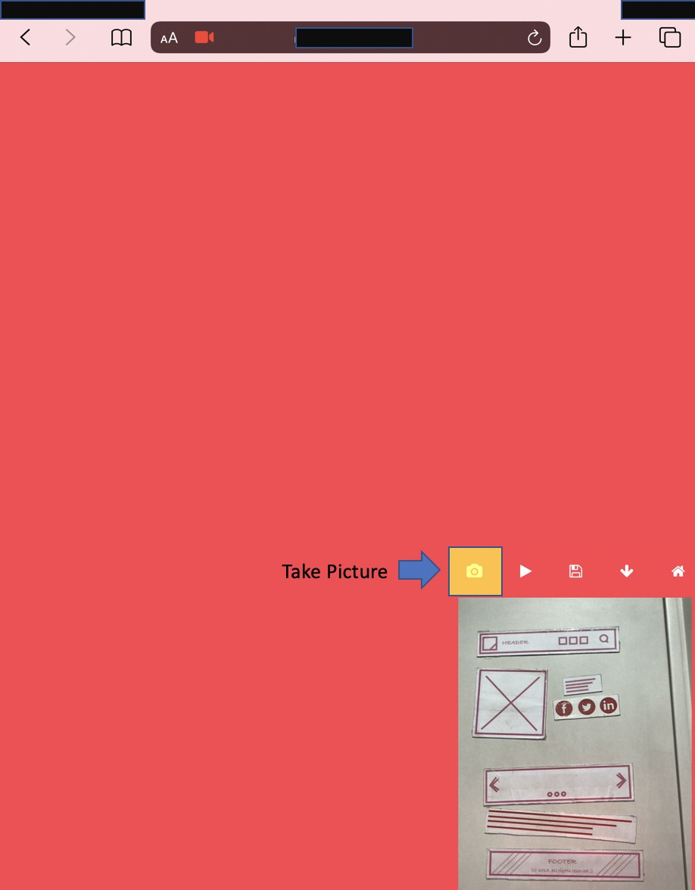
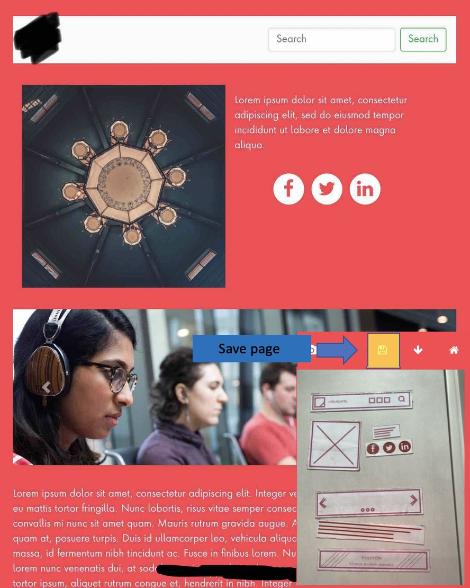

.. _idea2life_getting_started:

###############################
idea2Life Getting Started Guide
###############################

Installation
==============

**Install Using Docker**

#. Download and Install Docker Desktop for Mac using this
   link `docker-desktop <https://www.docker.com/products/docker-desktop>`_.
   and for linux using this link
   `docker-desktop on linux <https://docs.docker.com/install/linux/docker-ce/ubuntu/>`_

#.  Clone repo using this link
    `idea2Life repo <https://github.com/keplerlab/idea2life.git>`_

#.  Change your directory to your cloned repo.

#.  Download the `model file <https://drive.google.com/file/d/1bE0alaHVfnEjzqhj3EYMzB2RQOscDYdO/view?usp=sharing>`_
    inside `ai/models`.

#.  Open terminal and run following commands ::

          cd <path-to-repo> //you need to be in your repo folder
          docker-compose build

If you want to install idea2Life from source (without docker)
Refer this section Install and use idea2Life from source (without docker).

Supported Hardware and operating system
========================================

idea2Life software is supported on the following host operating systems:

* Linux
* mac OS X

**Minimum system configuration.**:

* Processor: Dual core Processor
* RAM: 4GB of system memory
* Hard disk space: 10 GB

**Recommended system configuration**:

* Processor: Intel core i7 or higher
* RAM: 8GB of system memory
* Hard disk space: 30 GB

How to start or stop idea2Life
==============================

**Start**

1. Open terminal and run the following commands::

        cd <path-to-repo> //you need to be in your repo folder

        docker-compose up

**Stop**

2. Open terminal and run the following commands::

        cd <path-to-repo> //you need to be in your repo folder

        docker-compose down

How to use idea2Life
====================

1. Download  and print templates. Download link:
`Idea2life_templates_for_print <https://drive.google.com/file/d/1MIeZj1EItCZbk7e1qTOrv3GTdOBdYXXB/view?usp=sharing>`_
preferably on magnetic sheets.
Cut individual templates like this and paste on magnetic sheets.

**Footer**

**Video**

2. Open the app on your tablet browser.::

        https://localhost:1813/

  you may have to replace **localhost** with your desktop/server **IP address**,
  Ensure idea2Life application and tablet is running in same network.

3.  Ignore/accept any certificate warning/error in your browser.

4.  Click on prototype/camera icon to begin prototyping.

5.   You will get to idea2Life prototype page.

6.   **Arrange printed templates** on table or metal surface according to
your desired webpage design.

7.   **Point camera** towards printed templates and **take picture**
by clicking on camera icon in control panel.

8. idea2Life will automatically generate a new webpage based
on laid out components.

|take_image| |arrow_image| |result_image|

.. |arrow_image| image:: images/arrow.jpeg
        :width: 8%
        :alt: arrow image

.. |result_image| image:: images/result_image_after_taking_picture.jpeg
        :width: 40%
        :alt: Result Image After Taking Picture

9. Press third **save icon button** if you want to save currently generated
template for  
:ref:`customization<How to customize generated pages>` later.

Take a look at demo video for more details:

.. raw:: html

    <video width=90% height=90% controls>
        <source src="_static/idea2life_short_video.mp4" type="video/mp4">
        Your browser does not support the video tag.
    </video>

10. Click on reset button/**play icon button** if you want to design new page. 

Refer :ref:`idea2life_how_to_guide`.  for advanced use cases.

