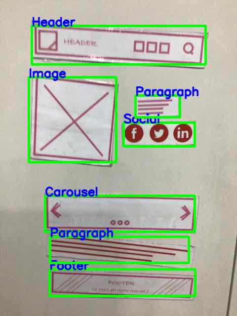

.. idea2Life documentation master file, created by
   sphinx-quickstart
   You can adapt this file completely to your liking, but it should at least
   contain the root `toctree` directive.

#######################
idea2Life documentation
#######################

Prototyping a web application is more about ideas than mere sketching wireframes. 
The biggest barrier to effective prototyping is time and cost. idea2Life is an AI powered rapid 
prototyping to lower the barrier of prototyping.

With idea2Life, you can create fully functional static websites by just clicking a picture.

|initial_image| |arrow_image| |template_image_intermediate| |arrow_image| |result_image|

Knowing the document organization will help you find and use features effectively and quickly:

*  **Getting Started** is guide for starting idea2Life service in shortest amount of time. Start here if you’re new to idea2Life.

*  **How-to guides** are recipes for idea2Life users. They guide you through the steps involved in addressing use-cases key issues.

*  **Developer guides** are recipes for idea2Life developer, who want to contribute and extend idea2Life functionality.

*  **Topic guides** discuss key topics and concepts at a fairly high level and provide useful background information and explanation 

*  **API reference** contain technical reference for APIs, mostly autogenerted from underlying code.

.. toctree::
   :maxdepth: 1

   
   Getting Started <getting_started>
   How to guides <how_to_guides>
   Developer guides <developer_guides>
   Topic guides <topic_guides>
   Troubleshooting and FAQ <troubleshooting>
   API reference <reference>

Indices and tables
==================

* :ref:`genindex`
* :ref:`modindex`
* :ref:`search`
